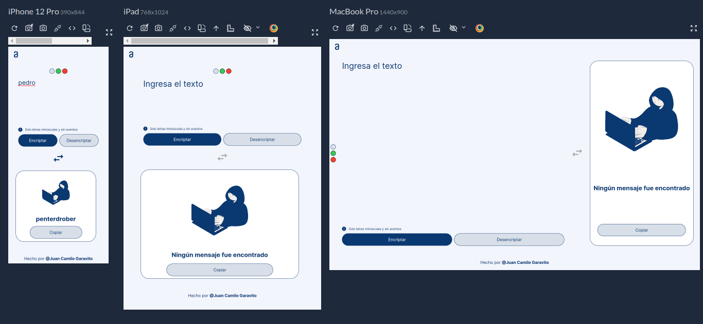

# Encriptador de Texto



## Descripción

Este proyecto es un encriptador de texto desarrollado como parte del programa Oracle Next Education. El objetivo era practicar nuestra lógica de programación y aplicar los conocimientos adquiridos en los cursos de HTML y CSS proporcionados por Alura Latam en colaboración con Oracle.


## Tecnologías Utilizadas

- HTML5
- CSS3
- JavaScript

## Instalación

1. Clona este repositorio en tu máquina local:
    ```bash
    git clone https://github.com/Juan-Garavito/Encriptador-Juan-Garavito.git
    ```
2. Navega hasta el directorio del proyecto:
    ```bash
    cd Encriptador-Juan-Garavito
    ``` 

## Uso

1. Abre el archivo `index.html` en tu navegador web.
2. Introduce el texto que deseas encriptar o desencriptar.
3. Haz clic en el botón correspondiente para ver el resultado.
4. Puedes copiar el texto encriptado o intercambiar entre textos.
5. Tambien puedes cambiar el color de la pagina.

## Desarrollado por

- **Nombre:** Juan Camilo Lozada Garavito
- **LinkedIn:** https://www.linkedin.com/in/juancamilogaravito/
- **GitHub:** https://github.com/Juan-Garavito


